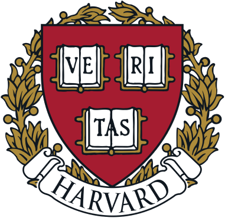

<h1 align="center">CS50x 2025</h1>

    

    
    
    
    
    
    

## Requirements

1. Follow [Using GCC with MinGW](https://code.visualstudio.com/docs/cpp/config-mingw) until your installation is [checked](https://code.visualstudio.com/docs/cpp/config-mingw#_check-your-mingw-installation).
2. Run `pacman -S --needed base-devel mingw-w64-ucrt-x86_64-cmake` in **MSYS2 UCRT64** terminal.
3. Open the terminal in **VS Code**.
4. Run `git clone https://github.com/serbouty/cs50x.git` to download the project.
5. Change the working directory with `cd cs50x` after cloning this repository.
6. Install [CMake Tools](https://marketplace.visualstudio.com/items?itemName=ms-vscode.cmake-tools) extension in VS Code.
7. Select **src/CMakeLists.txt** when asked.
8. Select **GCC** when asked.
9. Build executable files within **CMake: Project Outline**.

## Lectures

### Lecture 0 : Scratch

Computer Science. Computational Thinking. Problem Solving: Inputs, Outputs.
Representation: Unary, Binary, Decimal, ASCII, Unicode, RGB.Abstraction.
Algorithms. Running Times. Pseudocode. Scratch: Functions, Arguments,
Return Values; Variables; Boolean Expressions, Conditionals; Loops; Events; Threads.

### Lecture 1 : C

C. Source Code. Machine Code. Compiler. Correctness, Design, Style. Visual Studio Code.
Syntax Highlighting. Escape Sequences. Header Files. Libraries. Manual Pages. Types.
Conditionals. Variables. Loops. Linux. Graphical User Interface (GUI).
Command-Line Interface (CLI). Constants. Comments. Pseudocode. Operators. Integer Overflow.
Floating-Point Imprecision.

Code : [src/lecture1](src/lecture1)

### Lecture 2 : Arrays

Preprocessing. Compiling. Assembling. Linking. Debugging. Arrays. Strings.
Command-Line Arguments. Cryptography.

Code : [src/lecture2](src/lecture2)

### Lecture 3 : Algorithms

Searching: Linear Search, Binary Search. Sorting: Bubble Sort, Selection Sort, Merge Sort.
Asymptotic Notation: O, Ω, Θ. Recursion.

Code : [src/lecture3](src/lecture3)

### Lecture 4 : Memory

Pointers. Segmentation Faults. Dynamic Memory Allocation. Stack. Heap. Buffer Overflow.
File I/O. Images.

Code : [src/lecture4](src/lecture4)

### Lecture 5 : Data Structures

Abstract Data Types. Queues, Stacks. Linked Lists. Trees, Binary Search Trees.
Hash Tables. Tries.

Code : [src/lecture5](src/lecture5)

## Resources

### Harvard University

- [CS50x 2025](https://cs50.harvard.edu/x/2025/)
- [CS50's Library for C](https://github.com/cs50/libcs50)
- [Lecture 0 : Scratch](https://cs50.harvard.edu/x/2025/weeks/0/)
- [Lecture 1 : C](https://cs50.harvard.edu/x/2025/weeks/1/)
- [Lecture 2 : Arrays](https://cs50.harvard.edu/x/2025/weeks/2/)
- [Lecture 3 : Algorithms](https://cs50.harvard.edu/x/2025/weeks/3/)
- [Lecture 4 : Memory](https://cs50.harvard.edu/x/2025/weeks/4/)
- [Lecture 5 : Data Structures](https://cs50.harvard.edu/x/2025/weeks/5/)

### UC San Diego

- [Data Structures : Arrays](https://www.coursera.org/lecture/data-structures/arrays-OsBSF)

## Roadmap

- [x] Lecture 0 : Scratch
- [x] Lecture 1 : C
- [x] Lecture 2 : Arrays
- [x] Lecture 3 : Algorithms
- [x] Lecture 4 : Memory
- [x] Lecture 5 : Data Structures

## License

[MIT](LICENSE.md)
